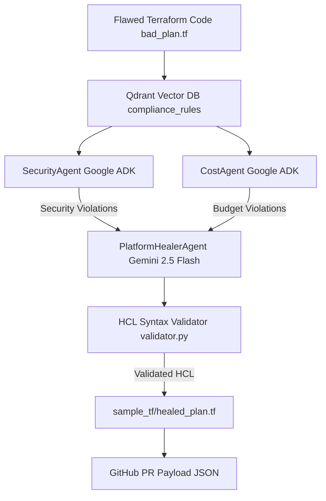

#  AutoOps-Agent: Autonomous Multi-Agent Platform Engineering Framework


**AutoOps-Agent** is an autonomous multi-agent platform engineering framework built for cloud infrastructure teams. It audits flawed AWS Terraform HCL files against vector compliance rules in Qdrant and uses Google ADK with Gemini 2.5 Flash to automatically remediate code flaws and publish ready-to-merge GitHub Pull Requests.

---

##  Problem Statement

Manual code reviews and infrastructure drift enforcement are slow, error-prone, and expensive. Security misconfigurations (such as open SSH ports) and over-budget cloud instance allocations often bypass manual checks, resulting in security breaches or unexpected cloud bills.

**AutoOps-Agent** solves this by embedding vector search rules into a multi-agent auditing and healing pipeline that operates autonomously on Terraform code.

---

## 🏗 System Architecture



---

##  Features

- **In-Memory Vector Rules Database**: Powered by **Qdrant** (`compliance_rules` collection) for lightning-fast compliance vector search.
- **Multi-Agent Infrastructure Audit**: Uses **Google ADK** (`SecurityAgent` and `CostAgent`) to identify vulnerabilities and budget violations.
- **Lyzr Studio Telemetry**: Lyzr integration wrapper for agent orchestration monitoring.
- **Gemini 2.5 Flash Auto-Healing**: Uses **PlatformHealerAgent** to automatically rewrite non-compliant Terraform HCL into secure, cost-effective HCL code.
- **HCL Syntax Validator**: Ensures matching brace structure and valid HCL blocks prior to output.
- **Automated GitHub Integration**: Formats and outputs ready-to-merge Pull Request JSON payloads.

---

##  Installation & Setup

1. **Clone the Repository:**
   ```bash
   git clone https://github.com/arjunrkj/AutoOps-Agent.git
   cd AutoOps-Agent
   ```

2. **Configure Environment Variables:**
   Copy `.env.example` to `.env` and add your Gemini API key:
   ```bash
   cp .env.example .env
   ```
   *`.env` contents:*
   ```env
   GEMINI_API_KEY=your_gemini_api_key_here
   LYZR_API_KEY=default_lyzr_key
   ```

3. **Install Dependencies:**
   ```bash
   pip install -r requirements.txt
   ```

4. **Run the Autonomous Pipeline:**
   ```bash
   python demo.py
   ```

---

##  Pipeline Results & Audit Metrics

### 1. Vector Rules Matched in Qdrant
| Rule ID | Category | Compliance Requirement | Status |
| :--- | :--- | :--- | :--- |
| **SEC-01** | Security | AWS Security Groups must never expose SSH port 22 to `0.0.0.0/0` | ❌ Violated -> ✅ Remediated |
| **COST-01** | Budget | AWS Database instances must not exceed `db.m5.large` or $300/mo budget | ❌ Violated -> ✅ Remediated |

---

### 2. Code Remediation Comparison

#### 🔴 Flawed Input (`sample_tf/bad_plan.tf`)
```hcl
resource "aws_security_group" "vulnerable_sg" {
  name = "allow_all_ssh"
  ingress {
    from_port   = 22
    to_port     = 22
    protocol    = "tcp"
    cidr_blocks = ["0.0.0.0/0"] # Violation: Open SSH
  }
}

resource "aws_db_instance" "overpriced_db" {
  allocated_storage = 1000
  engine            = "mysql"
  instance_class    = "db.m5.24xlarge" # Violation: Over-budget database
}
```

#### 🟢 Auto-Healed Output (`sample_tf/healed_plan.tf`)
```hcl
resource "aws_security_group" "vulnerable_sg" {
  name = "allow_internal_ssh"
  ingress {
    from_port   = 22
    to_port     = 22
    protocol    = "tcp"
    cidr_blocks = ["10.0.0.0/16"] # Fixed [SEC-01]: Restricted SSH access to VPC internal subnet
  }
}

resource "aws_db_instance" "overpriced_db" {
  allocated_storage = 100
  engine            = "mysql"
  instance_class    = "db.m5.large" # Fixed [COST-01]: Downsized instance class to fit $300/mo budget
}
```

---

### 3. Execution & GitHub PR Summary
- **HCL Syntax Validation**: `PASSED` (100% valid bracket and block integrity)
- **File Saved**: `sample_tf/healed_plan.tf`
- **GitHub PR Status**: `PASSED` (`mergeable_state: "clean"`)

```json
{
  "event": "pull_request",
  "action": "opened",
  "pull_request": {
    "title": "[AutoOps-Agent] Auto-Healed AWS Infrastructure Plan (SEC-01 & COST-01)",
    "branch": "autoops/remediate-bad-plan",
    "compliance_status": "PASSED",
    "qdrant_vector_verification": "SUCCESS",
    "syntax_validated": true,
    "modified_files": ["sample_tf/healed_plan.tf"],
    "mergeable_state": "clean"
  }
}
```

---

## 📁 Repository Structure

```text
autoops-agent/
├── requirements.txt         # Project dependencies
├── .env.example             # Environment template
├── app/
│   ├── __init__.py          # App package initializer
│   ├── vector_db.py         # Qdrant in-memory vector database
│   ├── agents.py            # Google ADK & Lyzr Multi-Agent definitions
│   └── validator.py         # HCL syntax validation logic
├── sample_tf/
│   ├── bad_plan.tf          # Flawed Terraform plan (Input)
│   └── healed_plan.tf       # Auto-remediated Terraform plan (Output)
├── demo.py                  # Interactive CLI pipeline
└── README.md                # Hackathon project documentation
```

---

##  Tech Stack & Acknowledgments

- **Google ADK** & **Gemini 2.5 Flash**: Multi-Agent orchestration & AI code remediation.
- **Qdrant**: High-performance vector database for compliance rule indexing.
- **Lyzr Studio**: Agent telemetry and workflow tracking.
- **Colorama**: CLI terminal styling.
